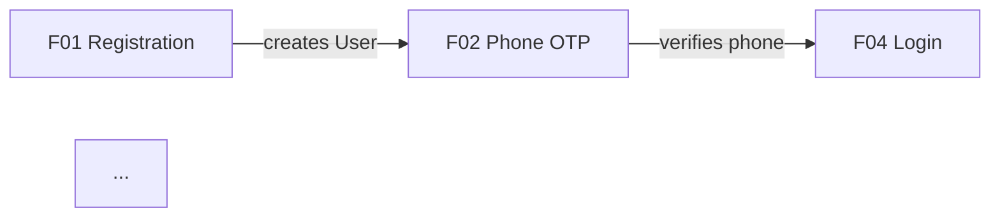
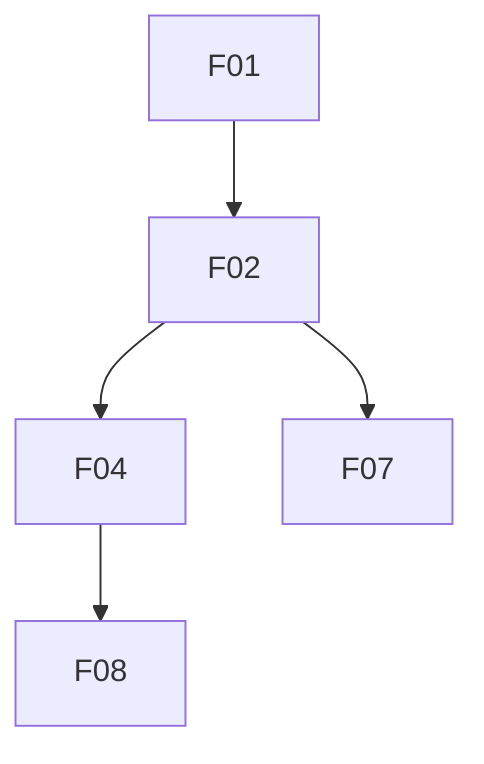

# /plan-module — module-level implementation plan

Produces a durable planning artefact at `docs/plans/<MXX>/module-plan.md` that answers the questions a per-feature plan cannot:

- **How do the features in this module interact?** (state diagram across features)
- **What shared data model do they read/write?** (locks the entity shapes)
- **What shared UI shells do they render?** (imports from `_shared/`, not re-implemented per feature)
- **What events flow between features?** (feeds M17 audit registration in one pass)
- **What's the auth / permission matrix?** (feature × role × precondition)
- **In what order must they ship?** (dependency DAG)
- **Which features need their own `/plan-feature`, and which are covered by this plan?** (§8 planning-necessity table)

`/plan-feature MXX-FXX`, `/design-feature MXX-FXX`, and `/feature-implementation MXX-FXX` all read `module-plan.md` as authoritative scope. If it doesn't exist, they fall back to relaxed mode (per-feature planning), but the module plan is the token-efficient path for interactive modules.

Applies to SRD-migrated modules (M01, M16, M17 today) and to modules still in `docs/MODULES.md` — same output shape.

## When to skip

Skip the module plan when:

- **≤2 features** in the module (M16 Team & Access today).
- **Features share nothing beyond namespace** — each feature stands alone with no shared entity, shell, event, or ordering constraint (M14 Reports, where each report is standalone).
- **Cross-cutting infra module** — no features to synthesise across.

Run the module plan when ANY of:

- ≥3 features share an entity (M01 Identity's `User`, M03 Financial's `Transaction`, M08 Stock's `Tank`).
- Features emit/consume each other's events (M01 auth flows, M04 credit/udhaar).
- A shared UI shell is rendered by ≥2 features (auth pages brand panel, dashboard chrome).
- Ordering constraints exist (F03 can't ship before F01).

## Workflow

Runs in **four phases**, gated by the user at each hand-off.

---

### Phase A — Resolve the module and load context

1. Parse the module ID from `$ARGUMENTS`. Accept `MXX` (case-insensitive).
   - Missing / unparseable → `AskUserQuestion` with options from `docs/SRD.md` modules whose lifecycle is `drafting` OR that don't yet have a `docs/plans/<MXX>/module-plan.md`.
2. Locate module artefacts:
   - **Preferred:** `docs/srd/M{XX}-*/README.md` (module spec) + glob `docs/srd/M{XX}-*/F*.md` (every feature file).
   - **Fallback:** `docs/MODULES.md` section `M{XX}` if the module isn't migrated yet.
   - Neither → return `BLOCKED: module MXX has no SRD directory or MODULES.md entry`.
3. Read in parallel:
   - Module `README.md` (mandatory)
   - Every `FXX-*.md` in the module (mandatory — this is the whole point)
   - `docs/AI-WORKFLOW.md` §propagation-rules (for lifecycle logic)
   - Any existing `docs/plans/<MXX>/module-plan.md` — if present, ask before overwriting (offer: refresh, iterate, cancel).
   - Any existing `docs/plans/<MXX>/<MXX-FXX>.md` files — flag them; feature plans that predate the module plan may need reconciliation.
4. State the resolved module ID + count of features loaded in one sentence.

**Delegate wide reads to Explore subagents** when the module has ≥5 features. Spawn one Explore per feature spec in parallel, breadth `quick`, prompt each to return: entity references, event emissions/consumptions, UI shell mentions, auth role requirements, cross-feature §7 deps. Synthesise the responses in the main thread.

### Phase B — Draft the module plan structure

Extract from the per-feature specs — none require the user yet:

- **§1 Cross-feature interaction diagram** — mermaid `graph LR` (or `stateDiagram-v2` for flow-heavy modules). Nodes = features by ID + title. Edges = interactions (`creates`, `authenticates`, `notifies`, `depends-on`, `emits-to`).
- **§2 Shared data model** — scan every feature's §3 requirements and §9 API surface. For each entity mentioned:
  - Which feature CREATES it (owner)
  - Which features READ it
  - Which features MUTATE it
  - Fields the module needs (union across features)
  - Table format: `| Entity | Owner | Read by | Mutated by | Fields (union) |`
  - Any feature that later invents a conflicting field shape must escalate via `ESCALATE_TO_SRD:`.
- **§3 Shared UI shells** — read features' §6 Design flow. Any layout / navigation / brand surface used by ≥2 features:
  - Name it (e.g. `AuthBrandPanel`, `DashboardChrome`)
  - Path it should live at (e.g. `fuel-flow-web/src/designs/_shared/auth-brand-panel.tsx`)
  - Features that render it
  - Table format: `| Shell | Path | Rendered by |`
- **§4 Event / audit flow** — cross-reference every feature's §8 Audit emissions. Build the emitter → event → consumer table:
  - Also flag which events need to be added to M17-F01 (Audit Event Schema)
  - Table format: `| Emitter | Event | Payload | Consumers | M17 registration |`
- **§5 Auth / permission matrix** — from each feature's §1 Purpose / §5 AC, extract the roles that can trigger the feature and the auth preconditions:
  - Table format: `| Feature | Roles allowed | Auth precondition | Notes |`
- **§6 Shipping sequence & dependency DAG** — from each feature's §7 Dependencies, build a topological order:
  - Mermaid `graph TD` showing which features must ship first for which
  - Note parallel-shippable groups
- **§7 Module-wide open questions** — read all feature specs critically. What questions span features? Common shapes:
  - "Should F04 and F07 share the same rate-limit bucket?"
  - "Does the `User.pin_hash` field belong on User (owned by F01) or on a separate PinCredential entity (owned by F07)?"
  - "Which feature owns the phone-verification lifecycle — F01 or F02?"
  - Prefix each with `MOQ-N:` (Module Open Question) for tracking.
- **§8 Per-feature planning necessity** — the routing table that decides whether `/plan-feature` runs per feature. For each feature in the module, decide:
  - **Yes, needs feature plan.md** — feature has feature-specific open questions, ≥3 screens with distinct compositions, non-obvious backend flow, or novel UX pattern.
  - **No, module plan covers it** — feature has ≤2 screens, follows an established module pattern (e.g. "another dashboard widget"), has no feature-specific open questions, and shares model+shell+events with siblings.
  - Table format: `| Feature | Needs feature plan? | Why |`
  - This is the **novel decision** of AI Workflow — the module plan itself decides how much per-feature planning is warranted.

Write to memory (don't file-write yet). This is the draft the user reviews.

### Phase C — Interactive review with backpressure

Present the module plan section by section. For each section use `AskUserQuestion` with options: **Approve**, **Iterate**, **Skip** (for sections that legitimately don't apply — e.g. §4 events for a UI-only module).

**Critical:** at any point in Phase C the user may surface a NEW cross-feature requirement or a spec conflict. Common shapes:

- "F04 and F07 shouldn't both own the pin field — let's put it on a separate entity."
- "We need to add an F09 for account recovery."
- "The auth matrix is wrong — Managers should be able to trigger F02."
- "F03's spec conflicts with the shipping order — it depends on F05 which is later."

When you detect this, DO NOT silently add it. Route via `AskUserQuestion`:

- **"Update the module plan only"** — for decisions that stay in this document (auth matrix corrections, shipping order changes).
- **"Escalate to `/feature-discovery` for SRD change"** — for anything that changes a feature's §3 Requirements, §7 Deps, §8 Audits, or §9 API. Invoke the `feature-discovery` skill via the Skill tool with the requirement text and the module ID as context. Let feature-discovery classify + apply SRD edits; then return to plan.
- **"Discard — thinking aloud"** — no action.

Do NOT let unvalidated cross-feature decisions slip in. The module plan is a contract — every entity, event, and auth rule must trace back to a validated SRD line.

### Phase D — Finalize and hand off

1. Assemble the `module-plan.md` content (structure below).
2. Present the full plan via `AskUserQuestion`:
   - **Approve and write to disk**
   - **Iterate on a specific section** (specify which)
   - **Cancel**
3. On approve:
   - Write `docs/plans/<MXX>/module-plan.md`.
   - If the module was `drafting` in `docs/SRD.md` AND every feature in the module is now at `spec-locked` or later, offer to bump the module lifecycle to `planned` (the "module plan approved; features can go for design/impl" state per `docs/AI-WORKFLOW.md`).
   - Update `docs/SRD.md` module heading `Lifecycle:` value if the flip is confirmed.
4. If any existing `docs/plans/<MXX>/<MXX-FXX>.md` files conflict with §2 shared model, §3 shared shells, or §4 events, offer to run `/plan-feature MXX-FXX --refresh` on each to reconcile. Do NOT auto-refresh — user must approve.
5. Print the hand-off summary:
   - Module plan file written
   - Module lifecycle change (if any)
   - Feature planning necessity summary (`Yes: F01, F04, F07 · No: F02, F03, F05, F06, F08`)
   - Recommended next commands per feature — for "Yes" features: `/plan-feature MXX-FXX`; for "No" features: proceed directly to `/design-feature MXX-FXX`.

## `module-plan.md` structure

```markdown
---
module: MXX
title: <from module README>
lifecycle_at_plan: <drafting | planned | ...>
features_in_scope: [F01, F02, F04, F07, F08, ...]
plan_last_updated: YYYY-MM-DD
---

# MXX — <module title> · Module Plan

> Authoritative synthesis for [`/plan-feature`], [`/design-feature`], [`/feature-implementation`], and [`/recap-module`].
> Module README: [MXX](../../srd/MXX-*/README.md)
> AI Workflow: [`docs/AI-WORKFLOW.md`](../../AI-WORKFLOW.md)

## 1. Cross-feature interaction diagram



## 2. Shared data model

| Entity | Owned by (creates) | Read by | Mutated by | Fields (union) |
|---|---|---|---|---|
| User | F01 | F04, F07 | F02 (phone_verified), F07 (pin_hash) | id, phone, phone_verified, pin_hash, ... |

Feature plans MUST NOT reshape these entities. Any conflict escalates via `ESCALATE_TO_SRD:`.

## 3. Shared UI shells

| Shell | Path | Rendered by |
|---|---|---|
| AuthBrandPanel | `fuel-flow-web/src/designs/_shared/auth-brand-panel.tsx` | F01, F02, F04, F07 |

Designs MUST import these — never re-implement.

## 4. Event / audit flow

| Emitter | Event | Payload | Consumers | M17 registration |
|---|---|---|---|---|
| F02 | `otp.verified` | `{userId, phone, verifiedAt}` | F04 (permits login), M17 audit | Add to M17-F01 §3 |

## 5. Auth / permission matrix

| Feature | Roles allowed | Auth precondition | Notes |
|---|---|---|---|
| F01 | anonymous | none | Registration |
| F04 | anonymous | phone_verified | Login |

## 6. Shipping sequence & dependency DAG



Parallel-shippable: F04 + F07 (both depend on F02, not on each other).

## 7. Module-wide open questions

- **MOQ-1:** Should F04 and F07 share the same rate-limit bucket?
- **MOQ-2:** Which feature owns the phone-verification lifecycle — F01 or F02?

## 8. Per-feature planning necessity

| Feature | Needs feature plan? | Why |
|---|---|---|
| F01 | **Yes** | 3-screen flow, novel OTP timing, feature-specific open questions |
| F02 | **No** | Single screen, established pattern, model+shell+events covered above |
| F04 | **Yes** | Novel auth mode, non-obvious edge cases |
| F07 | **No** | Single screen, mirrors F04 pattern |
| ... |

For "No" features, `/plan-feature MXX-FXX` returns `SKIP` and the pipeline advances directly to `/design-feature`.
```

## Contract with downstream skills

- **`/plan-feature MXX-FXX`** — Phase A reads `module-plan.md`. If §8 says "No" for this feature, returns `SKIP: covered by module plan §8`. If "Yes", produces a thinner plan.md that inherits §2 data model and §7 cross-feature deps from module plan.
- **`/design-feature MXX-FXX`** — Phase 0 reads module plan §3 shared shells; imports from `_shared/` rather than reinventing.
- **`/feature-implementation MXX-FXX`** — reads §2 data model as authoritative. Any entity reshape must escalate.
- **`/recap-module MXX`** — diffs module plan §§1–7 against shipped reality.

## Backpressure — escalation to SRD or feature-discovery

`/plan-module` may hit spec bugs:

- Two features' §7 Dependencies contradict each other (circular dep, contradicting relation).
- Two features claim to own the same entity or event.
- Spec is missing a critical field the module plan can't invent (e.g. `User.pin_hash` referenced by F07 but not declared anywhere).
- User surfaces a new cross-feature requirement mid-review (see Phase C).

Emit `ESCALATE_TO_SRD:` instead of writing module-plan.md:

```
ESCALATE_TO_SRD:
Module: MXX
Reason: <one paragraph — what's contradictory, missing, or new>
Suggested action: <invoke /feature-discovery / edit affected feature specs / user decision>
State: <what phase and section you were in — so we can resume>
```

Main thread:
1. Saves current state to `docs/plans/<MXX>/.module-plan-in-progress.md`
2. Presents escalation to user
3. On approval, invokes `/feature-discovery` with the reason
4. After SRD updated, offers to resume (`/plan-module MXX --resume`) or restart

The state file is markdown scratchpad — restart-safe. Delete after Phase D writes the final module-plan.md.

## Rules

- **One module per invocation.** Multi-module refactors → multiple invocations.
- **SRD is the source of truth.** Module plan is downstream — it never contradicts SRD, only synthesises across features. Contradiction → `/feature-discovery`.
- **§2 shared model is a lock.** Feature plans and implementations MUST inherit; deviations escalate.
- **§8 planning necessity is the routing decision.** Don't skip filling it in — it's the whole point of the module plan.
- **Module plan is durable.** Unlike per-feature plan.md (disposable after ship), module-plan.md stays — `/recap-module` diffs against it.
- **All propagated edits land in the same PR** as the primary edit — never as follow-ups.

## Cost note

A clean module-plan session should consume:

- 1 module README read
- N feature spec reads (parallel Explore subagents when N ≥ 5)
- Zero screenshots
- Zero agent spawns unless `/feature-discovery` is invoked mid-review

Target total: ~25k–60k tokens depending on module size. Pays for itself immediately by making per-feature plans optional (skips 3–5 `/plan-feature` invocations for typical modules) and by preventing cross-feature drift that would otherwise cost implementation cycles.
