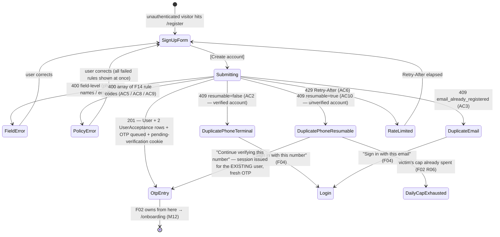

# M01-F01 — Self-Service Registration · Implementation Plan

> Canonical input for `/design-feature` and `/feature-implementation`.
> SRD spec: [M01-F01](../../srd/M01-identity-and-authentication/F01-registration.md)
> Module plan (authoritative for shared model, shells, events, cross-feature deps): [M01 module-plan](./module-plan.md)

M01's canonical reference feature — it sets the house patterns (auth shell, field
composition, error-summary behaviour, phone normalisation) that F02, F03, F04 and F06
inherit. A design already exists at
[`registration-form.tsx`](../../../fuel-flow-web/src/designs/M01-F01/registration-form.tsx);
this plan documents the contract behind it and closes the gaps planning surfaced.

## Screens

F01 owns **one** screen. The success handoff belongs to [F02](./M01-F02.md); the T&C
viewer and the blocking legal modal belong to F16.

| Screen | Purpose | States |
|---|---|---|
| **Sign-up form** | `firstName` + `lastName` (paired row), phone (accepts `+92…` or `0…`, normalises to E.164 on blur), optional email, password via F14's `<PasswordField>`, confirm-password, single T&C + Privacy checkbox with linked viewers, primary [Create account] CTA, "Already have an account? Sign in" link | `empty` (pristine, CTA disabled), `default` (filled), `field-error` (per-field; error summary takes focus per §4 a11y), `password-policy-error` (**array** of F14 rule codes, not one message), `loading`, `api-409-phone-verified` (terminal — "Sign in with this number"), `api-409-phone-resumable` (**R11** — "Continue verifying this number"), `api-409-email`, `api-429` (Retry-After countdown), `post-success` (transient → F02 — **not designed here**; F02's plan owns the Success-handoff screen, so F01 has no frame for it) |

The existing design covers `empty / default / error / loading / api-409 / api-429` across
desktop, tablet and mobile. **Three states it does not yet have** and `/design-feature`
must add: the resumable-409 variant (R11), the multi-rule password error array (R04), and
the split between verified and unverified duplicate-phone copy.

## User journey

## Backend flow

**`POST /api/v1/auth/register`** — body `{firstName, lastName, phone, email?, password}`.
`confirmPassword` is client-side only and never leaves the SPA.

- **Preconditions:** anonymous (module-plan §5). Per-IP sliding window 5 attempts / 10 min (§4).
- **201 — success:**
  - `User` row: `PhoneNumberConfirmed=false`, `EmailConfirmed=false`, bcrypt cost ≥ 12
    (module-plan §0), phone stored E.164, email case-folded.
  - **T&C stamp is atomic with the user row (R09):** two `UserAcceptance` rows (tos +
    privacy) **and** `User.AcceptedTcVersion` set to the accepted TOS version. Same
    transaction as the user insert — a user row with no acceptance rows is not a legal state.
  - `OtpChallenge` (`Purpose=registration`) queued via M10-F03.
  - **Pending-verification session cookie set** — `HttpOnly`, `Secure`, `SameSite=Lax`
    (module-plan §0). F02 R01 reads the phone from it. **F01 owns this contract**; see OQ1.
  - **No email is sent**, even when `email` is supplied. M12 Onboarding triggers the first
    verification email (F03 §1, corrected 2026-07-27).
  - Body `{userId, redirect: '/verify-phone'}`. Emits `auth.registration.attempted{outcome=success}`
    + `auth.registration.succeeded`.
- **400 — validation:** field-level errors. Password errors return an **array** of F14 rule
  codes (`password_too_short`, `password_no_digit`, `password_common`,
  `password_contains_personal`, `password_too_long`) per F14 R07 — never just the first.
- **409 `phone_already_registered`:** carries `resumable`. `false` when the existing account
  is phone-verified (terminal, AC2). `true` when it is still unverified (AC10 / R11) — the
  SPA offers to resume, which issues a pending-verification session for the **pre-existing**
  user and re-issues an OTP through F02's existing `POST /auth/resend-otp` path
  (`purpose=registration`). No new F02 machinery.
- **409 `email_already_registered`:** no row, no SMS.
- **429:** `Retry-After` header, no row.
- **Concurrency (§4 idempotency):** concurrent same-phone requests resolve to one row via the
  DB unique index — the loser catches the unique violation and maps it to the same 409 path,
  including the `resumable` determination.

### Abuse surface introduced by R11

The resumable 409 tells an unauthenticated caller whether a given number is registered-but-unverified,
and lets them trigger an SMS to it. R11 bounds this by making the resume path consume the
per-phone daily OTP cap (F02 R06, 10/day) and the per-IP window in R10 with **no separate
allowance**. Implementation must not treat resume as a fresh-registration path for
rate-limiting purposes. Note the endpoint already discloses existence by design (AC2/AC3
show "Sign in with this number"), so R11 widens an accepted disclosure rather than opening a
new one — but the *SMS* trigger is new and is the part the caps must cover.

## AC → surface mapping

| AC | UI screen | Backend behaviour | Backend-only? |
|---|---|---|---|
| AC1 | form → transient success → F02 | 201; User + 2 UserAcceptance rows + OTP + cookie, one transaction | no |
| AC2 | `api-409-phone-verified` + "Sign in with this number" | 409 `resumable=false`, no row/SMS | no |
| AC3 | `api-409-email` + "Sign in with this email" | 409, no row | no |
| AC4 | phone field error | 400 after E.164 normalisation | no |
| AC5 | password rule checklist (F14 component) | 400 `[password_too_short]` / `[password_no_digit]` | no |
| AC6 | `api-429` banner + countdown | 429 + `Retry-After` | no |
| AC7 | — (route guards) | guards keep phone-unverified user out of post-onboarding routes | mostly backend |
| AC8 | password rule checklist | 400 `[password_common]` (F14 R03 banned list) | no |
| AC9 | password rule checklist | 400 `[password_contains_personal]` | no |
| AC10 | `api-409-phone-resumable` + "Continue verifying this number" | 409 `resumable=true`; session for existing user; OTP re-issued under the shared cap | no |
| R08 | — | Owner-role user only; no org/station created (deferred to M12) | yes — invariant, no AC |
| R09 | T&C checkbox | atomic two-row acceptance + scalar fast-path | mixed |
| R10 | 429 banner | per-IP window + per-phone daily cap | mostly backend |
| R11 | resumable-409 state | see AC10 + abuse bounds above | no |

**Known coverage gap:** R08 has no acceptance criterion. It is a structural invariant
("registration creates an Owner and nothing else"), not an observable behaviour, so it is
covered by the unit test on the created-entity set rather than by an AC row.

## Open questions

Four material questions were resolved during this planning session and applied to the SRD
via `/feature-discovery` (see Change history). The following remain for `/design-feature` to
surface as CLARIFY prompts — all microcopy or interaction detail, none blocking:

- **OQ1:** Pending-verification session cookie contract. F02 R01 consumes it and F02's plan
  states **F01 defines its shape**, but neither spec pins it down. Needs a name, TTL (proposal:
  15 min, long enough to finish an OTP round-trip including one resend), and payload (proposal:
  `userId` + `purpose` only — never the phone in plaintext). **Pin this before implementation,
  not before design** — it is invisible to the UI but F02 is blocked on it.
- **OQ2:** Copy for the two duplicate-phone variants. The verified case ("Sign in with this
  number") and the resumable case ("Continue verifying this number") must be visually and
  verbally distinct enough that a user does not read them as the same dead end.
- **OQ3:** How to present F14's rule-code array. Inline checklist that updates as the user
  types (F14 §6's `<PasswordField>` intent) vs. a summary block on submit. The component is
  F14-owned, so F01's design should consume rather than redefine it.
- **OQ4:** `confirmPassword` — present in the design, absent from R05 and §9. Confirm it stays
  a client-only guard against typos and never enters the request body.
- **OQ5:** Error-summary focus behaviour (§4 a11y) and Urdu/RTL treatment of the paired
  `firstName` / `lastName` row, which is the only two-column field group in the form.
- **OQ6:** Whether the resumable-409 banner shows the masked phone back to the user.

## Test strategy

- **E2E (Playwright):**
  - **Happy path:** valid phone + password → 201 → lands on F02 OTP entry. Asserts
    pending-verification cookie is set and `HttpOnly`.
  - **Duplicate verified phone:** 409 → "Sign in with this number" → link routes to F04.
  - **Duplicate unverified phone (R11):** register, abandon OTP, register again → resumable
    banner → "Continue verifying" → lands on F02 with a fresh code. **The regression test for
    the lockout trap this plan fixed.**
  - **Duplicate email:** 409 → "Sign in with this email".
  - **Password policy:** `password1` → `[password_common]`; a password containing `firstName`
    → `[password_contains_personal]`; a password failing several rules → **all** codes render
    at once (F14 R07), not just the first.
  - **Rate limit:** 6th attempt in 10 min → 429 banner with countdown; no row created.
  - **Phone normalisation:** `03001234567` and `+923001234567` resolve to the same E.164 value
    and collide as duplicates.
  - **T&C:** submit with the box unticked → CTA disabled / blocked.
- **Unit:**
  - Phone normaliser: `0300…` → `+92300…`; `+92300…` → unchanged; `03abc` → invalid;
    `+91…` → invalid (non-PK).
  - **Registration transaction atomicity:** forced failure on the second `UserAcceptance`
    insert rolls back the `User` row — no user without acceptance (R09).
  - `resumable` resolver: verified existing → `false`; unverified existing → `true`; no
    existing → not applicable.
  - Rate-limit accounting: the resume path decrements the *same* per-phone daily counter as a
    fresh registration (R11) — the abuse bound, asserted directly.
  - Bcrypt cost ≥ 12 (module-plan §0).
  - Email case-folding + uniqueness collision (`Ali@Gmail.com` vs `ali@gmail.com`).
- **Not designable in TSX** (backend-only):
  - R08 (Owner-only entity set)
  - R09 transaction atomicity
  - R10 rate-limit windows
  - §4 privacy NFR (audit logs carry `phoneHash` / `emailHash`, never plaintext)
  - §4 idempotency (concurrent same-phone unique-index resolution)

## Analytics events

Client-side telemetry; the server-side audit trail in SRD §8 is separate.

- `register.viewed` — properties: `from_route`
- `register.phone_normalised` — properties: `input_format` (`local_0` / `e164`)
- `register.submitted` — properties: `has_email` (`true`/`false`)
- `register.error.viewed` — properties: `outcome` (`validation` / `duplicate_phone_verified` /
  `duplicate_phone_unverified` / `duplicate_email` / `rate_limited`), `failed_rules[]` when the
  outcome is a password-policy rejection
- `register.resume_offered` — properties: none. **Watch this one** — a high rate means users
  routinely abandon OTP verification, which is a funnel problem upstream of F01.
- `register.resume_accepted` — properties: `time_since_original_attempt_ms`
- `register.tc_viewer_opened` — properties: `kind` (`tos` / `privacy`)
- `register.success` — properties: `has_email`, `time_to_submit_ms`

## Data model impact

**Inherits from module-plan §2 shared model. Delta: none.**

- `User` created with all §2 fields; `AcceptedTcVersion` written at creation — module-plan §2's
  "Mutated by" column was corrected on 2026-07-27 to credit F01 alongside F16.
- `UserAcceptance` — two rows written per registration (F16 owns the entity; F01 is a writer).
- `OtpChallenge` — one row queued (F02 owns the entity).
- No new tables, no new columns. Config additions only: per-IP register window and per-phone
  daily OTP cap (§4), both already declared as module NFRs.

## Cross-feature dependencies

**See module-plan §1 interaction diagram. Delta: the F01 → F03 email-verify edge was removed
on 2026-07-27 (see Change history).**

- **Depends on** [F14 Password Policy](../../srd/M01-identity-and-authentication/F14-password-policy.md)
  — owns validation and the `<PasswordField>` component. **⚠️ `drafting`, no plan, no design.**
  Module-plan §6 puts F14 in ship group 1, ahead of F01; **F01 and F14 co-ship.**
- **Depends on** [F16 Terms & Privacy](../../srd/M01-identity-and-authentication/F16-terms-and-privacy-acceptance.md)
  — supplies the current version pointer and owns `Document` / `UserAcceptance`.
  **⚠️ `drafting`, no plan, no design.** Also ship group 1 — F01 cannot stamp acceptance
  against a version registry that does not exist.
- **Depends on** M10-F03 Notification Channels — SMS dispatch. **⚠️ `Planned`, and still in the
  deprecated `MODULES.md`.** M10-F03-R04 records that the current platform-default sender is a
  Play-Protect-blocked Android relay, so **AC1 cannot be verified end-to-end until a real SMS
  path exists.** This is the single largest delivery risk on the feature.
- **Depended on by** [F02 Phone OTP](../../srd/M01-identity-and-authentication/F02-phone-otp-verification.md)
  — consumes the queued OTP and the pending-verification session (OQ1). F01 §7's relation
  direction was corrected on 2026-07-27; it previously read "Depends on F02".
- **Depended on by** [F03 Email Verification](../../srd/M01-identity-and-authentication/F03-email-verification.md)
  — F01 records the address only. M12 triggers the first email.
- **Downstream:** M12 Onboarding picks up the verified user for org + station.
- **New requirements introduced during planning** (via `/feature-discovery`, 2026-07-27):
  - **M01-F01-R11** — resumable 409 for an unverified duplicate phone, bounded by the existing
    OTP caps.
  - **M01-F03-R10** — standing "Verify your email" prompt, closing the abandoned-onboarding gap
    created by moving the first-email trigger to M12.

## Change history

- **2026-07-27** — Initial plan. Routed via module-plan §8 ("Yes" — canonical reference feature;
  coordinates T&C + policy + OTP handoff). Four material open questions resolved during the
  session and applied to the SRD via `/feature-discovery` in one batch:
  - **T&C stamp (R09)** — reworded; two atomic `UserAcceptance` rows plus `AcceptedTcVersion`
    as a denormalised fast-path. F04 unaffected (field shape unchanged).
  - **Email verification trigger** — F01 does **not** send it; M12 does. F03 §1/§7 asserted the
    opposite in two places and were corrected; F03 gained R10 to close the resulting gap.
  - **Password policy (R04)** — rewritten to delegate to F14's active profile; AC8 + AC9 added
    for the banned-password cases F01 previously had no criterion for. F01 and F14 co-ship.
  - **Abandoned-registration recovery (R11, new)** — AC2 narrowed to verified accounts, AC10
    added for the unverified case. F04 (generic 401 by design) and F06 (reset succeeds but login
    still blocked) were both verified as non-viable escape hatches, making the registration 409
    the only workable resume point.
  - Also corrected in the same pass: F01 §7 F02 relation direction, F01 §6 + module README stale
    design paths, F01 §8 `outcome` enum, two broken `F10-email-change.md` links in F03,
    module-plan §1/§2/§3/§6, and a drifted lifecycle column in the M01 README.
  - No lifecycle flips — F01, F03, F14, F16 were all already `drafting`.
