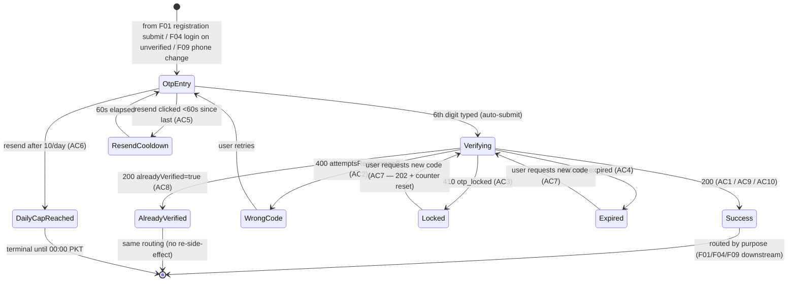

# M01-F02 — Phone OTP Verification · Implementation Plan

> Canonical input for `/design-feature` and `/feature-implementation`.
> SRD spec: [M01-F02](../../srd/M01-identity-and-authentication/F02-phone-otp-verification.md)
> Module plan (authoritative for shared model, shells, events, cross-feature deps): [M01 module-plan](./module-plan.md)
>
> **Pending refresh:** this plan predates the M01 module plan. `Data model impact`
> and `Cross-feature dependencies` sections here should be shrunk to reference
> module-plan §2 and §1 respectively. Run `/plan-feature M01-F02 --refresh`
> before picking up implementation.

## Screens

| Screen | Purpose | States |
|---|---|---|
| **OTP entry** | 6-cell code input with countdown + resend + masked phone display. Entry surface for all three flows (registration / login / phone-change). | default (empty), typing (partial fill), verifying (loading), wrong-code (with `attemptsRemaining` banner), locked (3rd fail — "Request new code" CTA), expired (past 5-min TTL — same CTA), resend-cooldown (60s countdown, resend disabled), daily-cap-reached (permanent block until 00:00 PKT + Sign-out link) |
| **Success handoff** | Brief confirmation (~800ms) then route to originating flow. Non-interactive; motion-only. | verified — `registration` → `/onboarding`; verified — `login` → `/dashboard`; verified — `phone-change` → owned by [F09](../../srd/M01-identity-and-authentication/F09-phone-number-change.md); already-verified (idempotent AC8 path, silent short-circuit) |

## User journey

## Backend flow

- **`POST /api/v1/auth/verify-phone`** — body `{ phone, code }`. Purpose is inferred server-side from the OTP row (per R10) — client does not supply it.
  - Preconditions: pending-verification session cookie carrying origin flow context (set by F01 / F04 / F09).
  - Side effects on success: flip `PhoneNumberConfirmed=true`, burn OTP row (`Status: used`), emit `auth.otp.verified` (or `auth.otp.already_verified` for AC8), issue routing token, promote session for `purpose=login`.
  - Failure modes: 400 with `attemptsRemaining` (AC2), 410 `otp_locked` (AC3), 410 `otp_expired` (AC4), 429 per R09.
  - NFR: p95 < 200 ms, idempotent — repeat verify of an already-succeeded code returns 200 same shape.
- **`POST /api/v1/auth/resend-otp`** — body `{ phone, purpose }`.
  - Preconditions: same session.
  - Side effects: enqueue SMS via M10-F03 sender, insert fresh `OtpChallenge` row with reset attempt counter, keep old row for audit trail, emit `auth.otp.resent`.
  - Failure modes: 429 `Retry-After` for cooldown (AC5), 429 `otp_daily_cap` for R06/AC6.
  - NFR: p95 < 100 ms excluding SMS dispatch.
- **Daily-cap window:** calendar day aligned to Asia/Karachi (UTC+5), resets at 00:00 PKT — codified in the M01 module NFR ([README](../../srd/M01-identity-and-authentication/README.md) §Rate limiting).

## AC → surface mapping

| AC | UI screen | Backend behaviour | Backend-only? |
|---|---|---|---|
| AC1 | OTP entry → Success (registration) | verify-phone happy path; route to `/onboarding` | no |
| AC2 | OTP entry — wrong-code banner + `attemptsRemaining` | verify-phone 400 | no |
| AC3 | OTP entry — locked state + "Request new code" CTA | verify-phone 410 `otp_locked` | no |
| AC4 | OTP entry — expired state + same CTA | verify-phone 410 `otp_expired` | no |
| AC5 | Resend button disabled + 60s countdown | resend-otp 429 with `Retry-After` | no |
| AC6 | Daily-cap-reached banner (permanent until 00:00 PKT) + Sign-out link | resend-otp 429 `otp_daily_cap` | no |
| AC7 | Success toast after "Request new code" click; return to fresh OTP entry | resend-otp 202 + counter reset | no |
| AC8 | (silent — SPA sees 200 and routes normally; guarded frontend intercept per OQ-7) | verify-phone short-circuit before OTP validation | mostly backend |
| AC9 | Success (login) → `/dashboard` | verify-phone + session promotion | no |
| AC10 | (F09 owns UI) | verify-phone flips `User.PhoneNumber` | yes (F02 delegates to F09) |

## Open questions

All resolved during planning on 2026-07-01. Kept here for archaeology; `/design-feature` will read these as answered.

- **OQ-1 → RESOLVED:** Auto-submit on the 6th digit, hide the Verify button. Fastest for the 99% case (SMS auto-fill, paste, or typing all 6). Matches iOS Chrome autofill behaviour.
- **OQ-2 → RESOLVED:** Phone number is masked on the OTP entry screen (`+92 300 ****567`). Confirms recipient without exposing full number to shoulder-surfers / screenshot leaks.
- **OQ-3 → RESOLVED:** Paste-only — no SMS Retriever app hash appended to the SMS body. Honours R11 (plaintext code only, no link-shaped detail). Android users paste; PWAs can't use SMS Retriever without a native shell anyway.
- **OQ-4 → RESOLVED:** Brief success confirmation (~800ms) then route. Small check-icon draw-in + "Phone verified" toast, then navigate. Perceived reliability > shaving 800ms.
- **OQ-5 → RESOLVED:** Formal, concise copy matching M01-F01 register form (e.g. "Verification failed. 2 attempts remaining." · "This code has expired." · "Wait 42 seconds before requesting a new code." · "Daily limit reached. Try again after midnight PKT.").
- **OQ-6 → RESOLVED (with SRD update):** Terminal lockout + daily-cap-hit state shows "Daily limit reached. Try again after midnight PKT." + Sign-out link. **Daily-cap window boundary escalated to `/feature-discovery` — added to M01 module NFR (calendar day Asia/Karachi, resets 00:00 PKT).** F02 §11 change history entry documents the discovery.
- **OQ-7 → RESOLVED:** Frontend route guard bounces already-verified users forward to their destination (uses AC8's idempotent 200 as fallback if the guard is bypassed).

## Test strategy

- **E2E (Playwright)** — mandatory paths:
  - **Happy path — registration purpose:** register → OTP typed → success → land on `/onboarding`
  - **Wrong-code with retry:** 2 wrong → 1 correct; assert `attemptsRemaining` decrement then success
  - **Lockout after 3 wrong:** verify "Request new code" CTA visible; click resend → fresh OTP → verify success
  - **Expired OTP:** mock time skip past 5-min TTL → verify expired state + same CTA
  - **Resend cooldown blocked:** click resend within 60s → verify 429 UX with countdown
  - **Daily-cap-reached (from resend loop):** 10 fresh OTPs issued → verify permanent block state + Sign-out link
  - **Already-verified guard (OQ-7):** authenticated user navigates to `/auth/verify-phone` → verify bounce to intended destination
- **Unit tests:**
  - OTP hasher — `Sha256WithPepper(code)` given / when / then
  - 6-digit code validator — accept `"123456"`, reject `"12345"`, `"1234567"`, `"12345a"`
  - Cooldown countdown timer — 60s from `issuedAt`, edge cases at boundary
  - Purpose → route resolver — `registration → /onboarding`, `login → /dashboard`, `phone-change → F09-owned`
  - Daily-cap counter with PKT boundary — issuance at 23:59 PKT counts to today; at 00:01 PKT counts to tomorrow
- **Not designable in TSX (backend-only):**
  - R07 hashing at rest (SHA-256 + per-tenant pepper) — integration test on Infrastructure
  - R09 rate-limit sliding window enforcement — integration test on API
  - R06 daily-cap enforcement — integration test with PKT boundary
  - Audit event emissions per §8 — integration test on the audit sink

## Analytics events

Client-side telemetry (server-side audit per §8 is separate):

- `otp.entry.viewed` — properties: `purpose` (registration / login / phone-change), `from_screen` (route where user came from)
- `otp.entry.autofill_used` — properties: `platform` (ios / android_paste — no android_retriever per OQ-3)
- `otp.entry.submitted` — properties: `attempt_number`, `time_to_enter_ms`
- `otp.resend.clicked` — properties: `cooldown_wait_ms` (0 if allowed, positive if blocked)
- `otp.error.viewed` — properties: `outcome` (`wrong_code` / `expired` / `locked` / `cooldown` / `daily_cap`)
- `otp.success.routed` — properties: `purpose`, `to_route`

## Data model impact

New table on the control-plane DB (identity tables live in control-plane per M14 pattern):

- **`OtpChallenge`**
  - `Id` (Guid, PK)
  - `UserId` (Guid, FK to `Users`)
  - `PhoneHash` (bytea, indexed) — SHA-256 + per-tenant pepper of the raw phone
  - `CodeHash` (bytea) — SHA-256 + per-tenant pepper of the 6-digit code
  - `Purpose` (enum `OtpPurpose`: `registration` / `login` / `phone-change`)
  - `IssuedAt` (timestamptz)
  - `ExpiresAt` (timestamptz) — `IssuedAt + 5 minutes`
  - `Attempts` (int, default 0)
  - `Status` (enum `OtpStatus`: `active` / `used` / `locked` / `expired`)
  - `LastAttemptAt` (timestamptz, nullable)
- **Indexes:**
  - `IX_OtpChallenge_PhoneHash_Status_ExpiresAt` — active-OTP lookup on verify
  - `IX_OtpChallenge_UserId_IssuedAt_DESC` — daily-cap counting with PKT boundary
- **New enums:** `OtpPurpose`, `OtpStatus`
- **Migration:** `Add_OtpChallenge` — control-plane DbContext
- **Config additions** (via `appsettings.json` + IOptions):
  - `Otp:CodeLength` (default 6, matches R02)
  - `Otp:TtlMinutes` (default 5, matches R03)
  - `Otp:MaxAttempts` (default 3, matches R04)
  - `Otp:ResendCooldownSeconds` (default 60, matches R05)
  - `Otp:DailyCap` (default 10, matches R06)
  - `Otp:DailyCapTimezone` (default `Asia/Karachi`, matches new M01 NFR)

## Cross-feature dependencies

- **Depends on:** [M10-F03 Notification Channels](../../MODULES.md#m10-f03--notification-channels) — **⚠️ unmigrated (MODULES.md)**. SMS sender must exist for OTP delivery. Coordinating: the SMS payload shape (R11: plaintext code only, no deep link) is F02's contract on M10-F03.
- **Depends on:** [M01-F01 Registration](../../srd/M01-identity-and-authentication/F01-registration.md) — **⚠️ drafting**. Queues the first OTP on registration submit; defines the pending-verification session cookie shape that F02 consumes.
- **Used by:** [M01-F04 Login](../../srd/M01-identity-and-authentication/F04-login.md) — **drafting**. Login on a phone-unverified account routes here.
- **Used by:** [M01-F09 Phone Number Change](../../srd/M01-identity-and-authentication/F09-phone-number-change.md) — **drafting**. Verifies the new number before committing the swap (owns AC10).
- **Post-success target:** [M12 Onboarding](../../MODULES.md#m12--onboarding--first-run-experience) — **⚠️ unmigrated**. `purpose=registration` success routes to `/onboarding`.
- **New requirements introduced during planning** (via `/feature-discovery`):
  - **M01 module NFR clarification (2026-07-01):** Daily-cap window is a calendar day aligned to Asia/Karachi (PKT, UTC+5), resets at 00:00 PKT. Inherited by every M01 feature with a daily cap (F01, F02, F03, F06, F09). See M01 README `Rate limiting` NFR + F02 §11 change history.
