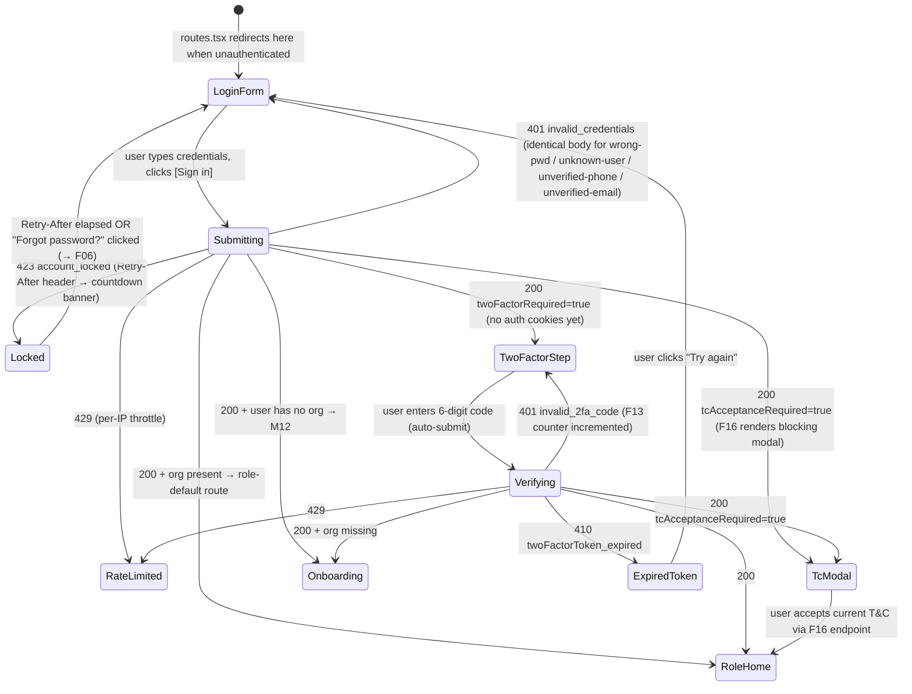

# M01-F04 — Login · Implementation Plan

> Canonical input for `/design-feature` and `/feature-implementation`.
> SRD spec: [M01-F04](../../srd/M01-identity-and-authentication/F04-login.md)
> Module plan (authoritative for shared model, shells, events, cross-feature deps): [M01 module-plan](./module-plan.md)

## Screens

| Screen | Purpose | States |
|---|---|---|
| **Login form** | One identifier field with phone/email auto-detect, password field with reveal toggle, "Remember this device" checkbox, primary [Sign in] CTA, "Forgot password?" and "Sign up" links, footer legal blurb | `default`, `password-revealed`, `submitting`, `field-error` (identifier or password format), `inline-invalid-credentials` (generic 401 per AC3), `locked` (423 with Retry-After countdown banner), `rate-limited` (429), `post-success` (invisible transient) |
| **2FA step** | 6-digit TOTP input (single accessible group, auto-submit on 6th digit), [Verify] CTA, "Use a recovery code instead" link, "Cancel and sign in again" link | `default`, `verifying`, `wrong-code` (401 with attemptsRemaining hint from F13), `expired-token` (410 twoFactorToken_expired — routes back to login form), `rate-limited` (429) |
| **T&C required overlay** | F16 owns the modal; F04 detects the `tcAcceptanceRequired=true` flag in the 200 response and triggers F16's blocking modal on top of the intended landing route | Handoff only — F16 provides the modal + acceptance endpoint |

## User journey

## Backend flow

- **`POST /api/v1/auth/login`** — body `{identifier: string, password: string, rememberDevice?: boolean}`.
  - Preconditions: none (public endpoint). Per-IP sliding window (20 attempts / 10 min per §4 NFR).
  - Success — no 2FA: cookies set (access 15 min · refresh 30 d, or 90 d if `rememberDevice`; both `HttpOnly`, `Secure`, `SameSite=Lax` per module-plan §0); body `{userId, redirect: '/dashboard' | '/onboarding/...', tcAcceptanceRequired: boolean}`. Session row created (F08) with `Trusted: rememberDevice ?? false`. Emit `auth.login.succeeded`.
  - Success — 2FA required: body `{twoFactorRequired: true, twoFactorToken: string}`; no cookies. `twoFactorToken` is a short-lived JWT (5-min TTL, single-use, jti-tracked so it can be burnt). Emit `auth.login.2fa_required`.
  - Failure modes:
    - 401 `invalid_credentials`: identical body for wrong-pwd, unknown-user, unverified-phone, unverified-email (per revised R02 + AC3). F13 counter incremented for known users only. Emit `auth.login.failed` with `outcome`.
    - 423 `account_locked`: `Retry-After` header; body `{unlockAt: ISO8601, escalationLevel: 1..5}` (from F13). No counter increment.
    - 429: per-IP throttle. `Retry-After` header.
  - Side effects on success: create Session row (F04 populates; F08 owns lifecycle) with `DeviceId, DeviceLabel, UserAgent, Ip, GeoCountry (MaxMind GeoLite bundled per module-plan MOQ-4), Trusted, IssuedAt`. GeoIP lookup is synchronous but bounded (<10ms).

- **`POST /api/v1/auth/login/2fa`** — body `{twoFactorToken: string, code: string}`. Code may be a 6-digit TOTP or a recovery code (F12 handles the discrimination).
  - Preconditions: valid unburnt `twoFactorToken`. Per-IP throttle same as login.
  - Success: burn `twoFactorToken` (single-use per R08), create Session row, issue cookies. Body same as no-2FA login success. Emit `auth.login.2fa_verified`.
  - Failure modes:
    - 401 `invalid_2fa_code`: `twoFactorToken` NOT burnt (user can retry with the same token until TTL expires); F13 counter incremented. Emit `auth.login.2fa_failed`.
    - 410 `twoFactorToken_expired`: SPA routes back to login form with a hint ("Session expired — sign in again").
    - 429.
- **NFRs codified in `Auth:*` config keys** (added by F04 impl):
  - `Auth:AccessTokenMinutes = 15`
  - `Auth:RefreshTokenDays = 30`
  - `Auth:RefreshTokenTrustedDays = 90`
  - `Auth:TwoFactorTokenTtlMinutes = 5`
  - `Auth:LoginRateLimitPerIpAttempts = 20`
  - `Auth:LoginRateLimitPerIpWindowMinutes = 10`

## AC → surface mapping

| AC | UI screen | Backend behaviour | Backend-only? |
|---|---|---|---|
| AC1 | Login form → post-success redirect | 200 with cookies, Session created | no |
| AC2 | Login form (email variant of auto-detect) → redirect | 200 with cookies | no |
| AC3 | Login form → inline generic invalid-credentials error | 401 identical body across 4 failure cases | no |
| AC4 | Login form → 2FA step | 200 `twoFactorRequired=true` | no |
| AC5 | 2FA step → post-success redirect | 200 with cookies, `twoFactorToken` burnt, Session created | no |
| AC6 | 2FA step → wrong-code error | 401 `invalid_2fa_code`; F13 counter++ | no |
| AC7 | Login form → locked banner + Retry-After countdown | 423 `account_locked` (from F13) | no |
| AC8 | (invisible — SPA reads `redirect` field) | Backend redirect resolver: onboarding-incomplete → M12; else role-default | mostly backend |
| AC9 | Login form → F16 T&C modal overlay | 200 `tcAcceptanceRequired=true`; F16 renders modal | mixed (F04 detects, F16 owns modal) |
| AC10 | Login form → "Remember this device" checkbox | Server: `Session.Trusted = true`, refresh cookie `Max-Age=90d` | mixed |
| AC11 | Login form → rate-limited banner | 429 per-IP; no counter increment | no |

## Open questions

Resolved during planning on 2026-07-08. `/design-feature` will read the OQ resolutions as answered.

- **OQ1 → RESOLVED:** "Remember device" is a server-side `Session.Trusted` flag. SPA sends `rememberDevice: true` in the login body; server sets `Session.Trusted = true` and extends the refresh-token cookie TTL to 90 days. F08 can revoke trust independently of the cookie. Matches module-plan §2 Session shape (`Trusted` field already declared there).
- **OQ2 → DEFERRED to F15:** F04 emits `auth.login.succeeded` on every successful sign-in. Whether F15 alerts on new-ua+ip, on country-mismatch, or both is F15's decision — it lives in F15's rules engine, not F04. F04's plan does not need to answer this.
- **OQ3 → RESOLVED (with SRD edit):** R02 rewritten to defer to AC3's `invalid_credentials` for all four failure cases (wrong-pwd, unknown-user, unverified-phone, unverified-email) — removes the info leak that the original R02 wording implied. F02-resume UX for a just-registered user is client-side (using the pending-verification session cookie set by F01), not a distinct login-endpoint response. SRD F04 R02 wording updated + §11 change history entry added on 2026-07-08. Cascade scan: §7 deps unchanged, §8 audits unchanged, §9 API unchanged, module-plan §§2/4/5 unchanged.
- **OQ4 → RESOLVED:** When both `tcAcceptanceRequired=true` AND onboarding-incomplete apply, T&C wins (legal gate first). SPA renders F16 modal on top of the intended landing route (whether `/dashboard` or `/onboarding/…`); onboarding actually starts only after T&C is accepted via F16's endpoint.

Deferred to `/design-feature` as CLARIFY prompts (microcopy / UX details, not blocking for the plan):

- **OQ5:** Copy for the generic error message. Fully generic ("Sign-in failed. Check your credentials.") vs. slightly-more-natural ("The phone or password you entered is incorrect."). Leaning fully generic to preserve enumeration resistance.
- **OQ6:** "Remember device" default state — off (more secure) vs. on (more convenient). Leaning off.
- **OQ7:** When to flip identifier input `inputmode` from `numeric` → `email`. On first `@` character typed? On focus? Leaning "on `@` typed" as the least brittle heuristic.
- **OQ8:** Rate-limit message copy tone.

## Test strategy

- **E2E (Playwright):**
  - **Happy path (phone):** phone user, correct password, no 2FA → land on `/dashboard`. Asserts cookies set, redirect target correct.
  - **Happy path (email):** verified-email user, password → land on `/dashboard`.
  - **Wrong password:** inline generic error visible; retry with correct password succeeds.
  - **Unknown user:** identical inline error as wrong-password (visual identity test, not just backend body match).
  - **2FA path:** password OK → 2FA step visible → correct TOTP → dashboard. Assert `twoFactorToken` intermediate state has no auth cookies.
  - **2FA wrong code:** 401 error banner; retry works (token not burnt).
  - **2FA expired token:** mock time skip → routes back to login form with hint copy.
  - **Lockout after 5 fails:** 5 wrong-passwords → 423 → banner shows Retry-After countdown; correct password after countdown succeeds.
  - **T&C required:** login success with `tcAcceptanceRequired=true` → F16 modal renders (mock F16 response for this test).
  - **Onboarding redirect:** owner-with-no-org → `/onboarding` per M12 target.
  - **Remember device:** checkbox checked → refresh cookie `Max-Age=7776000` (90 days); `Session.Trusted=true` on the created row.
- **Unit:**
  - `IdentifierDetector`: `"03001234567"` → phone; `"ali@gmail.com"` → email; `"03abc"` → invalid; `"@only"` → invalid.
  - `TwoFactorToken` hasher + TTL boundary (T-1s valid, T+1s expired).
  - `SessionRowBuilder`: correct DeviceId derivation, GeoIP lookup timeout fallback (empty country vs. server error).
  - Redirect resolver: `{orgId: null}` → `/onboarding`; `{orgId, tcAcceptance: null}` → `/dashboard` with `tcAcceptanceRequired: true`; `{orgId, tcAcceptance: currentVersion}` → `/dashboard`.
  - Bcrypt cost verification (cost ≥ 12 per module NFR).
- **Not designable in TSX** (backend-only):
  - R04 (bcrypt constant-time compare)
  - R08 (`twoFactorToken` TTL + single-use)
  - R09 (F13 owns the lockout state machine)
  - R10 (F13 counter feed)
  - R11 (Session row creation — F04 populates, F08 owns lifecycle)
  - §4 NFR observability (structured Serilog event per attempt)

## Analytics events

Client-side telemetry (server-side audit per SRD §8 is separate):

- `login.viewed` — properties: `from_route` (where user was before), `has_saved_identifier` (browser autofill populated)
- `login.identifier_switched_mode` — properties: `to_mode` (`phone` / `email`)
- `login.submitted` — properties: `channel` (`phone` / `email`), `remember_device` (`true`/`false`)
- `login.error.viewed` — properties: `outcome` (`invalid_credentials` / `locked` / `rate_limited`)
- `login.2fa.viewed` — properties: `time_since_password_step_ms`
- `login.2fa.submitted` — properties: `attempt_number`, `code_length` (6 for TOTP; recovery codes have different length so we can trace fallback usage)
- `login.2fa.recovery_used` — properties: none
- `login.success.redirected` — properties: `to_route` (`/dashboard` / `/onboarding` / role-home), `tc_required` (`true`/`false`), `two_factor_used` (`true`/`false`)

## Data model impact

**Inherits from module-plan §2 shared model. Delta: none.**

- `User` fields read: `PhoneNumber`, `PhoneNumberConfirmed`, `Email`, `EmailConfirmed`, `PasswordHash`, `TwoFactorEnabled`, `LockedUntil`, `AcceptedTcVersion`. All already in §2.
- `Session` fields written on creation: `Id`, `UserId`, `DeviceId`, `DeviceLabel`, `UserAgent`, `Ip`, `GeoCountry`, `Trusted`, `IssuedAt`. All already in §2.
- `RefreshToken` created and rotated on each refresh (F08 owns the rotation). Fields already in §2.
- `twoFactorToken` intermediary: short-lived JWT (or Redis key). NOT a persisted entity — not in §2 by design. Signed with `Jwt:Secret` (existing user-secret per README setup); `jti` claim tracks single-use burn.

No new tables. No new columns. **Config additions only** — see Backend flow above (`Auth:*` keys).

## Cross-feature dependencies

**See module-plan §1 interaction diagram. Delta: none.**

- **Depends on** [F02 Phone OTP Verification](../../srd/M01-identity-and-authentication/F02-phone-otp-verification.md) — reads `PhoneNumberConfirmed`.
- **Depends on** [F03 Email Verification](../../srd/M01-identity-and-authentication/F03-email-verification.md) — reads `EmailConfirmed`. **Currently `design-approved` on branch `feat-m01-f03-email-verification`; PR #45 to `m01-main` not yet merged.** F04 impl can proceed regardless (F03 only ships the design at this stage, and the `EmailConfirmed` field is already in module-plan §2).
- **Depends on** [F12 2FA](../../srd/M01-identity-and-authentication/F12-two-factor-authentication.md) — F12 owns `twoFactorToken` validation logic and TOTP verify. F04 issues the token and calls into F12.
- **Depends on** [F13 Account Lockout](../../srd/M01-identity-and-authentication/F13-account-lockout-and-unlock.md) — F13 owns the counter, lock state machine, and the 423 response body. F04 feeds fail events.
- **Depends on** [F16 T&C Acceptance](../../srd/M01-identity-and-authentication/F16-terms-and-privacy-acceptance.md) — F16 owns the current version pointer and the acceptance-recording endpoint. F04 detects `tcAcceptanceRequired` and triggers the modal.
- **Used by** [F08 Sessions](../../srd/M01-identity-and-authentication/F08-device-and-session-management.md) — each login creates a Session row.
- **Used by** [F15 Suspicious-Activity Alerts](../../srd/M01-identity-and-authentication/F15-suspicious-activity-alerts.md) — subscribes to `auth.login.*` events.
- **New requirements introduced during planning** (via inline SRD edit; no `/feature-discovery` cascade fired because scope was contained):
  - **F04 R02 rewrite (2026-07-08)** — removed info-leak wording. See F04 SRD §11 change history.

## Change history

- **2026-07-08** — Initial plan. All 4 material OQs resolved during planning (OQ1 remember-device storage; OQ2 deferred to F15; OQ3 R02 SRD edit; OQ4 T&C-before-onboarding). Structural gate + OQ resolution gate + write gate all approved by user in one session. Feature routed via module-plan §8 "Yes" — F04 orchestrates too many cross-feature interactions to skip planning.
