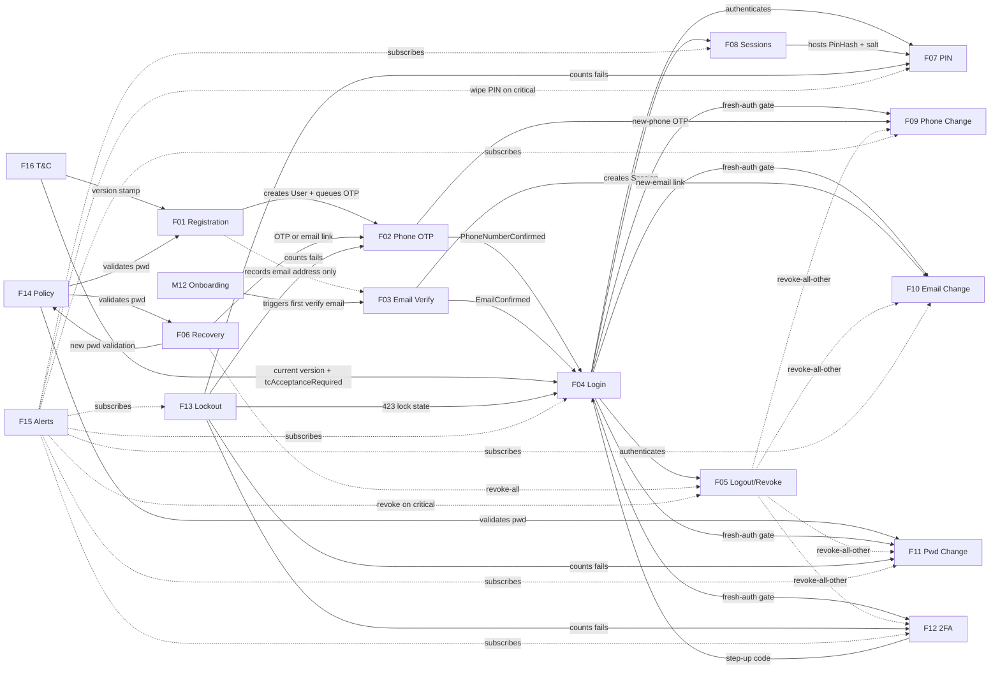
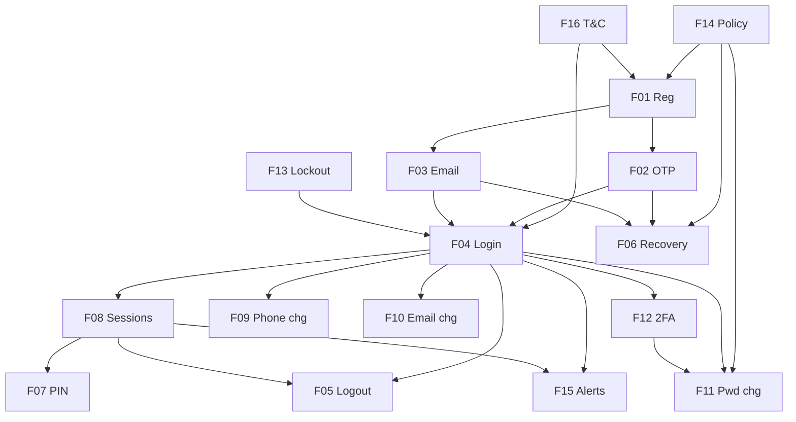

# M01 — Identity & Authentication · Module Plan

> Authoritative synthesis for `/plan-feature`, `/design-feature`, `/feature-implementation`, and `/recap-module`.
> Module README: [M01](../../srd/M01-identity-and-authentication/README.md)
> AI Workflow: [`docs/AI-WORKFLOW.md`](../../AI-WORKFLOW.md)

## 0. Locked module-wide invariants

Established during module planning. Referenced by feature plans / implementations.

| Invariant | Value | Config key | Notes |
|---|---|---|---|
| Password bcrypt cost | ≥ 12 | (in `Auth:PasswordHashCost`) | Module NFR |
| OTP hash | SHA-256 + per-tenant pepper | `Otp:HashPepper` | Module NFR |
| Refresh tokens | hashed at rest | — | Module NFR |
| Cookies | `HttpOnly`, `Secure`, `SameSite=Lax` | — | Module NFR |
| p95 latency | < 300 ms excl. SMS/email dispatch | — | Module NFR |
| OTP daily-cap window | Calendar day, `Asia/Karachi` (UTC+5), resets 00:00 PKT | `Otp:DailyCapTimezone` | Established during M01-F02 planning |
| Fresh-password-auth window | 5 minutes | `Auth:FreshPasswordWindowMinutes` | MOQ-6. Applies to F07 (PIN setup), F09, F10, F11, F12 setup/disable |
| Access token expiry | 15 minutes | `Auth:AccessTokenMinutes` | MOQ-3 — we accept this as the maximum revocation window |
| Session invalidation | Refresh-token rotation (no `sessionVersion` claim) | — | MOQ-3 |
| GeoIP source | MaxMind GeoLite (bundled, offline; monthly refresh via CI) | — | MOQ-4. Shared by F08 sessions + F15 alerts |
| Password history | None in v1 | — | MOQ-5. F14 explicitly does not track history |
| T&C canonical language | English | — | MOQ-7. Urdu is translation only; no locale stored on UserAcceptance |
| 2FA gate on credential changes | F11 only when 2FA enabled | — | MOQ-8. F09/F10 gated by fresh-password re-auth alone |

## 1. Cross-feature interaction diagram

## 2. Shared data model

**Locked** — feature plans and implementations MUST inherit these shapes. Any conflict escalates via `ESCALATE_TO_SRD:`.

| Entity | Owner (creates) | Read by | Mutated by | Fields (union) |
|---|---|---|---|---|
| **User** | F01 | F04, F06, F07, F09, F10, F11, F12, F13, F15 | F01 (`AcceptedTcVersion` — set at creation), F02 (`PhoneNumberConfirmed`), F03 (`EmailConfirmed`), F06 (`PasswordHash`), F09 (`PhoneNumber`+`PhoneNumberConfirmed`), F10 (`Email`+`EmailConfirmed`+`PendingEmailChange`), F11 (`PasswordHash`), F12 (`TwoFactorSecret`, `TwoFactorEnabled`, `RecoveryCodesHashes`), F13 (`AccessFailedCount`, `LockedUntil`, `EscalationCount`), F16 (`AcceptedTcVersion` — on re-acceptance) | `Id`, `PhoneNumber`, `PhoneNumberConfirmed`, `Email?`, `EmailConfirmed`, `PendingEmailChange?`, `PasswordHash`, `TwoFactorSecret?`, `TwoFactorEnabled`, `RecoveryCodesHashes?`, `AccessFailedCount`, `LockedUntil?`, `EscalationCount`, `AcceptedTcVersion`, `CreatedAt` |
| **OtpChallenge** | F02 | F02, F09 | F02 (`Status: active→used/locked/expired`, `Attempts++`) | `Id`, `UserId`, `PhoneHash`, `CodeHash`, `Purpose` (`registration`/`login`/`phone-change`/`password-recovery`), `IssuedAt`, `ExpiresAt`, `Attempts`, `Status`, `LastAttemptAt?` |
| **EmailVerificationToken** | F03 | F03, F06, F10 | F03 (`Status: active→used/expired`) | `Id`, `UserId`, `EmailHash`, `TokenHash`, `Purpose` (`registration`/`email-add`/`email-change`/`password-recovery`), `IssuedAt`, `ExpiresAt`, `Status` |
| **PasswordResetToken** | F06 | F06 | F06 (`Status: active→used/expired`) | `Id`, `UserId`, `Channel` (`phone`/`email`), `TokenHash`, `IssuedAt`, `ExpiresAt`, `Status` |
| **Session** | F04 (creates), F08 (owns lifecycle) | F05, F07, F08, F15 | F05 (`RevokedAt`, `RevokedReason`), F07 (`PinHash`, `PinSalt`, `PinAttempts`, `PinLastUnlockAt`), F08 (`LastSeenAt`, `Trusted`) | `Id`, `UserId`, `DeviceId`, `DeviceLabel`, `UserAgent`, `Ip`, `GeoCountry?`, `Trusted`, `IssuedAt`, `LastSeenAt`, `RevokedAt?`, `RevokedReason?`, `PinHash?`, `PinSalt?`, `PinAttempts`, `PinLastUnlockAt?` |
| **RefreshToken** | F04 | F08 | F08 (rotate + `RevokedAt` on refresh), F05/F06/F11 (revoke-all) | `Id`, `SessionId`, `TokenHash`, `IssuedAt`, `ExpiresAt`, `RevokedAt?`, `ReplacedById?` |
| **Document** (T&C / Privacy) | F16 | F01, F04, M17 | F16 (immutable, publish-only) | `Id`, `Kind` (`tc`/`privacy`), `Version`, `ContentSha256`, `PublishedAt`, `EffectiveAt`, `PublishedByUserId` |
| **UserAcceptance** | F16 | F04 (gate check), M17 | append-only | `Id`, `UserId`, `DocumentId`, `AcceptedAt`, `Ip`, `Ua`, `Source` (`registration`/`login`) |

**Not first-party entities (behavioural only):**
- **F14 Password Policy** — validator + `<PasswordField>` component. No stored state. Policy profile lives in org settings (M16).
- **F15 Suspicious Activity** — rules engine + dispatch queue. Consumes events; emits notifications. No first-party entities.

**Notes on MOQ-1 (locked as `OtpChallenge`):** F02 SRD uses "OTP row" abstractly and does not declare an entity name, so no SRD rename cascade is required. The existing [M01-F02 plan](./M01-F02.md) already uses `OtpChallenge`; this module plan promotes that name to module-wide canonical.

**Notes on MOQ-2 (PIN storage):** PIN hash + salt live on the `Session` row as F07 spec requires. PIN dies naturally when the session dies (matches F07 R08 7-day inactivity expiry).

## 3. Shared UI shells

**Locked** — designs MUST import from `_shared/` rather than re-implementing.

| Shell | Path | Rendered by | Notes |
|---|---|---|---|
| **AuthBrandPanel** (rotating scenes + gradient cross-fade) | `fuel-flow-web/src/designs/_shared/brand-surfaces.tsx` (+ `brand-scenes.ts`) | F01, F02, F03, F04, F06 | Already exists (established in M01-F01 canonical design) |
| **AuthFormColumn** (stepper + paired fields + CTA wipe) | `fuel-flow-web/src/designs/_shared/auth-shell.tsx` (+ `form-bits.tsx`, `form-states.ts`, `inline-alert.tsx`) | F01, F02, F04, F06 | Established in M01-F01 |
| **PasswordField** (F14 component — live strength meter + rule checklist + eye toggle) | `fuel-flow-web/src/components/forms/password-field.tsx` | F01, F06, F11 | Owned by F14; used by three surfaces |
| **OtpEntry** (6-cell input, auto-submit, countdown, resend) | `fuel-flow-web/src/components/auth/otp-entry.tsx` | F02, F06 (phone-recovery), F09 (phone-change) | Owned by F02 |
| **PasswordReAuthPrompt** (fresh-auth ≤5 min gate) | `fuel-flow-web/src/components/auth/password-reauth.tsx` | F07 (PIN setup), F09, F10, F11 (implicit), F12 (setup/disable/regenerate) | New shared component |
| **ProfileNavShell** (Account / Security tabs) | `fuel-flow-web/src/components/profile/nav-shell.tsx` | F05, F07, F08, F09, F10, F11, F12 | New shared component |
| **SessionRow** (device label + city/country + last-seen + revoke button) | `fuel-flow-web/src/components/sessions/session-row.tsx` | F05 (revoke), F08 (list) | Owned by F08 |
| **BlockingLegalModal** (T&C diff summary + accept gate) | `fuel-flow-web/src/components/legal/blocking-modal.tsx` | F04 (login gate), F16 | Owned by F16 |

## 4. Event / audit flow

Every event listed here MUST be registered in M17-F01 Audit Event Schema in the same PR as the feature that emits it. Feature designs / plans do NOT re-declare; they reference this table.

| Emitter | Event(s) | Payload sketch | Consumers | M17 note |
|---|---|---|---|---|
| **F01** | `auth.registration.attempted` `.succeeded` | `{phoneHash, emailHash?, ip, ua, outcome}` | M17 | Register in F01 PR |
| **F02** | `auth.otp.issued` `.verified` `.failed` `.resent` `.already_verified` `.rate_limited` | `{userId, phoneHash, purpose, attemptNumber, ip}` | M17, F04 (`.verified` permits login) | Register in F02 PR |
| **F03** | `auth.email.verification_sent` `.verified` `.already_verified` `.verification_failed` `.resend_rate_limited` | `{userId, emailHash, ip}` | M17, F04 (`.verified` permits login on email channel) | Register in F03 PR |
| **F04** | `auth.login.attempted` `.succeeded` `.failed` `.2fa_required` `.2fa_verified` `.2fa_failed` | `{userId, sessionId, channel, ip, ua, trustedDevice}` | F08 (create session), F13 (fail counter), F15 (new-device/country rule) | Register in F04 PR |
| **F05** | `auth.session.logged_out` `.revoked` `.revoke_all` | `{userId, sessionId, ip, reason, sessionsRevoked?}` | F08 (filter list), M17 | Register in F05 PR |
| **F06** | `auth.password_reset.requested` `.sent` `.confirmed` `.failed` `.rate_limited` | `{identifierHash, channel, ip, outcome?}` | M17, F15 (courtesy notification) | Register in F06 PR |
| **F07** | `auth.pin.setup` `.unlock_succeeded` `.unlock_failed` `.revoked` `.org_disabled` | `{userId, sessionId, deviceId, ip, consecutiveFails?}` | F13 (fail counter), M17 | Register in F07 PR |
| **F08** | `auth.session.created` `.expired_idle` `.expired_cap` `.replay_detected` | `{userId, sessionId, deviceId, ip, geoCountry?, trusted, ua}` | F15 (new-device / country / replay rules) | Register in F08 PR. `lastSeenAt` writes are coalesced and NOT audited per-hit — sampled per-day only. |
| **F09** | `auth.phone_change.started` `.cancelled` `.confirmed` `.failed` `.quota_exceeded` | `{userId, oldPhoneHash, newPhoneHash, sessionsRevoked?}` | F15 (credential-change) | Register in F09 PR |
| **F10** | `auth.email.add_started` `.change_started` `.change_completed` `.removed` `.change_failed` | `{userId, oldEmailHash?, newEmailHash?, sessionsRevoked?}` | F15 | Register in F10 PR |
| **F11** | `auth.password.change_attempted` `.change_succeeded` `.change_failed` | `{userId, ip, sessionsRevoked, pinsRevoked}` | F13 (fail counter), F15 | Register in F11 PR |
| **F12** | `auth.2fa.setup_started` `.enabled` `.disabled` `.recovery_used` `.recovery_regenerated` `.code_failed` | `{userId, ip, sessionsRevoked, pinsRevoked, factor}` | F13 (`.code_failed`), F15 | Register in F12 PR |
| **F13** | `auth.lockout.fail_counted` `.locked` `.escalated` `.unlocked` | `{userId, ip, source, consecutiveFails, escalationCount}` | F15 (critical alerts) | Register in F13 PR |
| **F14** | `auth.password.policy_violation` `.policy_profile_changed` | `{userId?, surface, failedRules}` or `{orgId, actorUserId, oldProfile, newProfile}` | M17 | Register in F14 PR |
| **F15** | `auth.alert.evaluated` `.dispatched` `.muted` `.escalation_action` | `{userId, rule, channel, priority, idempotencyKey?}` | M17 | Register in F15 PR |
| **F16** | `legal.document.published` `legal.acceptance.recorded` `.prompted` `.bypass_attempted` | `{documentId, kind, version, sha256, userId?, source?}` | M17 | **New `legal.*` namespace** — flag for M17-F01 when F16 lands |

## 5. Auth / permission matrix

| Feature | Roles allowed | Auth precondition | Notes |
|---|---|---|---|
| F01 Registration | anonymous | none | phone-first, email optional |
| F02 Phone OTP | anonymous (registration purpose) OR authenticated (login/phone-change) | pending-verification session cookie | purpose-dependent per §2 `OtpChallenge.Purpose` |
| F03 Email Verification | anonymous (link click) OR authenticated (resend endpoint) | token via GET param | |
| F04 Login | anonymous | none | issues session on success |
| F05 Logout / Revoke | any-authenticated | valid session | own sessions only |
| F06 Password Recovery | anonymous | none | leak-proof responses regardless of user existence |
| F07 PIN Quick Login | any-authenticated | **fresh password re-auth ≤5 min for setup** (MOQ-6); PIN itself for daily unlock | device-scoped; org policy via M16 may restrict per role |
| F08 Sessions | any-authenticated | valid session | own sessions only |
| F09 Phone Change | Owner | **fresh password re-auth ≤5 min** (MOQ-6); PIN not sufficient | R01. No 2FA gate in v1 (MOQ-8) |
| F10 Email Change | Owner | **fresh password re-auth ≤5 min** (MOQ-6); PIN not sufficient | R01. No 2FA gate in v1 (MOQ-8) |
| F11 Password Change | Owner | authenticated session; **TOTP required if 2FA enabled** (MOQ-8) | PIN not sufficient (R07) |
| F12 2FA (setup/disable/regen) | Owner | **fresh password re-auth ≤5 min** (MOQ-6) | M16 may force setup per role (R09) |
| F12 2FA (login step-2) | any user with `TwoFactorEnabled=true` | valid pending-2FA session | intermediary state between F04 password verify and F04 session creation |
| F13 Lockout | anonymous (triggers on fail); Owner (unlock via M16) | none for triggers | Owner unlock action lives in M16 |
| F14 Password Policy | anonymous (validation surface); Owner via M16 (profile toggle) | none | validation runs client + server |
| F15 Alerts | any-authenticated (receive + mute); Owner (aggregated view via M16) | valid session | |
| F16 T&C Acceptance | anonymous (signup accept); any-authenticated (re-accept on version bump) | none | English canonical (MOQ-7) |

## 6. Shipping sequence & dependency DAG

**Ship groups (parallelisable within group):**

| Group | Features | Notes |
|---|---|---|
| **1. Foundation** | F14, F16 | No cross-feature deps. Ship first — everything downstream needs them |
| **2. Onboarding channels** | F01 → then F02, F03 in parallel | F01 blocks F02/F03; F02/F03 have no interdep. **F03 is only partly shippable inside M01** — F01 records the address but M12 Onboarding triggers the first verification email, so F03's end-to-end path also depends on M12. F03 R10's standing "Verify your email" prompt is the M01-only surface that does not need M12 |
| **3. Auth core** | **F04 + F13 co-ship** | F04 needs F13's 423 lock behaviour; F13 needs F04's fail events to count. Ship as one PR. |
| **4. Session infra** | **F05 + F08 co-ship** | F08 owns list + `SessionRow`; F05 owns revoke actions on that list. Ship as one PR. |
| **5. PIN** | F07 | Needs F04 + F08 (Session row owns PinHash) |
| **6. Recovery** | F06 | Needs F02 + F03 + F14 + F05 |
| **7. Credential edits (parallel)** | F09, F10, F11, F12 | All need F04 + F05. F11 also needs F12 shipped first (2FA TOTP gate — MOQ-8). Adjusted order: F12 → then F09, F10, F11 in parallel |
| **8. Alerts** | F15 | Subscribes to already-shipped events; safe to ship last |

## 7. Module-wide open questions (all resolved during planning)

- **MOQ-1 → RESOLVED (2026-07-08):** OTP entity named `OtpChallenge`. Renamed in F02 SRD in the same PR as this module plan (§11 change history entry added).
- **MOQ-2 → RESOLVED (2026-07-08):** PIN hash + salt live on `Session` row as F07 spec requires. Simpler joins; PIN lifecycle tied to session (matches F07 R08 inactivity expiry naturally).
- **MOQ-3 → RESOLVED (2026-07-08):** No `sessionVersion` claim. Access tokens remain valid until 15-min natural expiry after revocation. F05 revoke-all cuts the session at next refresh. Correct trade-off for filling-station app.
- **MOQ-4 → RESOLVED (2026-07-08):** GeoIP source is MaxMind GeoLite bundled with the API (offline lookup, monthly CI refresh). Shared by F08 sessions + F15 alerts — no divergence.
- **MOQ-5 → RESOLVED (2026-07-08):** No password history in v1. F14 does not track history; F06 and F11 accept any policy-compliant password. Can add later as an F14 R-row via `/feature-discovery` when there's a compliance driver.
- **MOQ-6 → RESOLVED (2026-07-08):** Fresh-password-auth window is **5 minutes**, codified as `Auth:FreshPasswordWindowMinutes = 5`. Applies to F07 PIN setup, F09 phone change, F10 email change, F11 password change (implicit via session), F12 2FA setup/disable/regenerate.
- **MOQ-7 → RESOLVED (2026-07-08):** T&C canonical language is English. Urdu is translation only; **no `Locale` field on `UserAcceptance`** row. Legal disputes reference the English canonical text regardless of what the user saw.
- **MOQ-8 → RESOLVED (2026-07-08):** In v1, only **F11 Password Change** requires TOTP gate when 2FA enabled. F09 phone change and F10 email change rely on fresh-password re-auth alone; the new phone/email itself gets OTP/link verified. Simplest scope, highest-value target (password rotation) gated.

New module-wide questions will be appended here as `MOQ-N` when they surface.

## 8. Per-feature planning necessity

**Locked routing for the 16 features.** For "No" features, `/plan-feature MXX-FXX` returns `SKIP: covered by module plan §8` and the pipeline advances directly to `/design-feature`.

| Feature | Needs `/plan-feature`? | Why |
|---|---|---|
| **F01** Registration | **Yes** | Canonical reference feature; sets house patterns; coordinates T&C + policy + OTP handoff; design already exists but no impl plan yet |
| **F02** Phone OTP | **Yes** (plan.md exists — refresh) | plan already exists at [`M01-F02.md`](./M01-F02.md). Refresh to (a) reference module-plan §2 for `OtpChallenge` shape, (b) reference module-plan §4 for events, (c) note MOQ resolutions |
| **F03** Email Verification | **No** | Mirrors F02's shape with email channel — inherits shared model + shell + event pattern from module plan |
| **F04** Login | **Yes** | Orchestrates 2FA + lockout + T&C gate; novel identifier auto-detect; 3 screens; feature-level OQ1 (remember-device storage) and OQ2 (new-device alert criteria) unresolved |
| **F05** Logout & Revocation | **No** | Two simple actions on shared `SessionRow` + top-level "Sign out everywhere else" button; module plan §4 covers events |
| **F06** Password Recovery | **Yes** | 5 screens with dual-channel branching; novel leak-proof response pattern; feature-level OQ1 (leak-proof response wording) still unresolved |
| **F07** PIN Quick Login | **Yes** | 8 screens; device-scoped state machine; exponential backoff; org-policy integration; feature-level OQ1 (role scoping), OQ2 (inactivity wipe) unresolved |
| **F08** Sessions | **Yes** | Refresh-token rotation + replay detection is subtle; coalesced last-seen writes; UI is only 2 screens but backend impl plan needed |
| **F09** Phone Change | **Yes** | 6 screens; novel dual-OTP + cancellation-link pattern; feature-level OQ1 (single vs double OTP), OQ2 (lockout duration) unresolved |
| **F10** Email Change | **Yes** | State-aware CTA row (Add / Change / Remove); dual-email state; feature-level OQ1 (email history) unresolved (OQ2 covered by MOQ-8) |
| **F11** Password Change | **No** | Straightforward form pattern; module plan §4 covers cascading revocations; MOQ-5/MOQ-8 cover OQ1/OQ2 |
| **F12** 2FA | **Yes** | 7 screens; RFC-6238 skew tolerance; recovery-code lifecycle; org-policy enforcement; feature-level OQ1 (recovery count), OQ2 (backup secret) unresolved |
| **F13** Lockout | **No** | No first-party UI (surfaces on F04/F06/M16 as message strings); backend rules straightforward; MOQ-3 covers session-cache question |
| **F14** Password Policy | **No** | Single reusable `PasswordField` component + policy validator; MOQ-5 answers the history question |
| **F15** Suspicious Activity Alerts | **Yes** | Rules engine + multi-channel dispatch + cooldowns + muting; feature-level OQ2 (Owner notification channels), OQ3 (device link UX) unresolved (OQ1 covered by MOQ-4) |
| **F16** T&C Acceptance | **Yes** | Versioning + diff-summary modal + scroll-to-end debate; feature-level OQ1 (material vs cosmetic updates), OQ3 (scroll gate) unresolved (OQ2 covered by MOQ-7) |

**Summary:** 11 features need `/plan-feature` — F01, F02 (refresh), F04, F06, F07, F08, F09, F10, F12, F15, F16. 5 features skip straight to `/design-feature`: F03, F05, F11, F13, F14.

Token estimate savings vs planning every feature: ~5 × 12k = **~60k tokens** for M01.

## 9. Contract with downstream skills

- `/plan-feature MXX-FXX` reads §8 to route. Feature plan inherits §2/§3/§4 rather than re-declaring.
- `/design-feature MXX-FXX` reads §3 shared shells and imports from `_shared/`. First feature to need a new shared shell adds it to `_shared/` and appends a row here.
- `/feature-implementation MXX-FXX` reads §2 data model as authoritative — cannot reshape entities. Reads §4 for event registrations to add to M17-F01.
- `/recap-module M01` diffs §§1–7 against shipped reality at the end.

## 10. Change history

- **2026-07-08** — Initial module plan. §8 planning-necessity routing set (11 Yes, 5 No). All 8 MOQs resolved during plan session. MOQ-1 locked as `OtpChallenge`; no F02 SRD rename required (the SRD refers to "OTP row" abstractly). Existing M01-F02 plan.md already conforms.
- **2026-07-27** — Corrections surfaced during `/plan-feature M01-F01`:
  - **§1** — the `F01 -->|queues email verify| F03` edge was wrong. F01's SRD never claimed to send the first verification email (R07/AC1 cover SMS only); F03's spec claimed it did, in two places. Resolved in F01's favour: F01 records the address, **M12 Onboarding triggers the first email**. Edge downgraded to "records email address only" and an M12 trigger node added. F03 §1/§7 updated to match, and F03 gained R10 (standing "Verify your email" prompt) to close the abandoned-onboarding gap this opens.
  - **§2** — `User.AcceptedTcVersion` credited F16 as sole mutator; F01 also sets it at creation (F01 R09, reworded the same day). Ownership clarification only — the field's shape is unchanged, so `design-approved` F04, which reads it for the `tcAcceptanceRequired` gate, does **not** revert.
  - **§3** — shared-shell paths pointed at `_shared/brand-panel.tsx`, which does not exist. Corrected to the shipped `brand-surfaces.tsx` / `auth-shell.tsx` (plus the sibling modules each actually pulls in).
  - **§6** — ship group 2 now records that F03 is only partly shippable inside M01, since its end-to-end path depends on M12 (unmigrated).
  - No lifecycle flips: every affected feature (F01, F03) was already `drafting`, and the module remains `drafting`.
